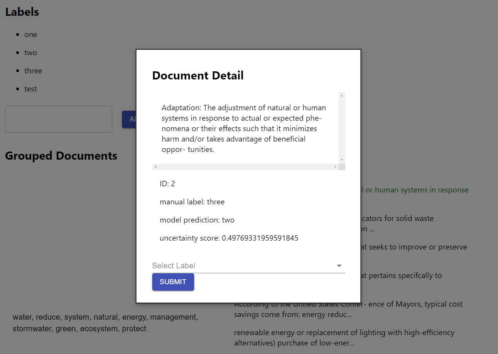

# Document Annotation App

An interface for annotating documents, with the help of topic models and active learning.

Frontend is written in React, backend is written in Python (FastAPI).



## Features

- View documents clustered by topic
- Add, delete and rename labels
- Active learning: we recommend the next document to label
- Label predictions


## Run locally

Documentation: https://docs.google.com/document/d/17RkE-zmmuZYC3jWuBitwCuxxpng6DebMe17he2OZFds/edit#heading=h.8ioudbs2b60t

**FIRST, download data by running `bash get_dataset.sh`**

Need: `poetry`, `yarn`

You need two windows: one for the frontend, one for the backend+reverse proxy

Window 1:
Run backend:  
````bash
poetry install
poetry shell
python -m spacy download en_core_web_sm
uvicorn backend.server:app --host 0.0.0.0 --port 81 --reload
````

Window 2:
````bash
cd frontend
yarn install
yarn start
````

Access app at http://localhost:3000/  

## Deploy on server

To deploy on server use `docker-compose up`

## Architecture

### Frontend
- `frontend/src/`
  - `Views/Dashboard.jsx`: the UI container
  - `App.jsx`


### Backend

`backend/server.py` - main server

